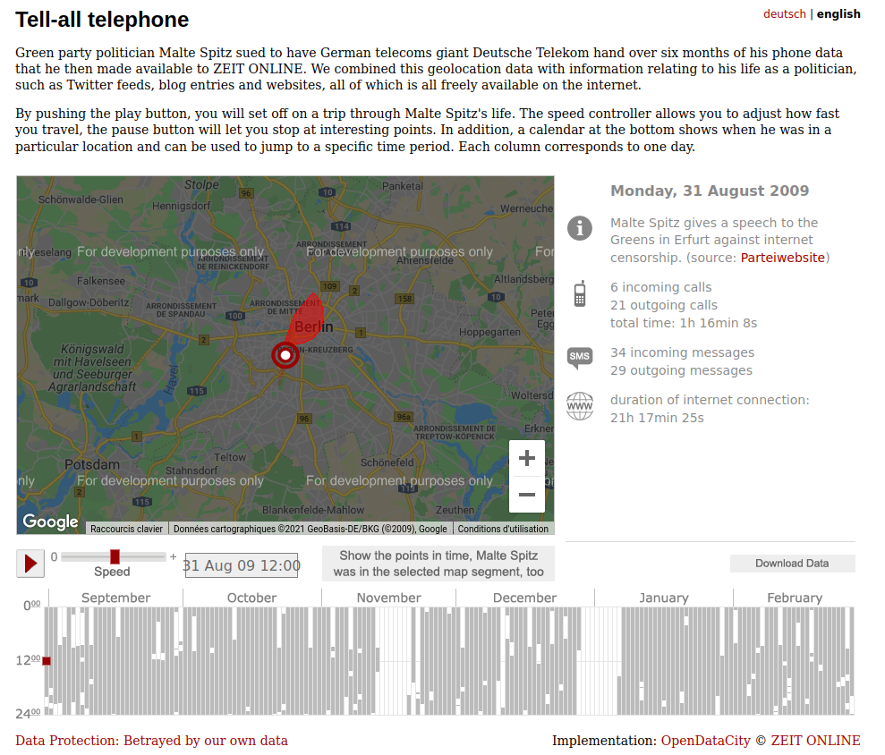
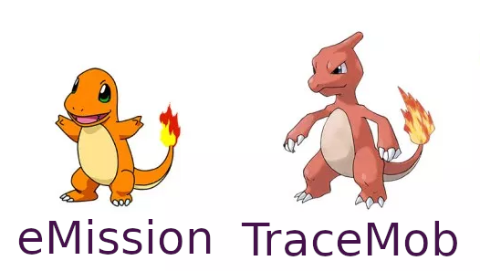
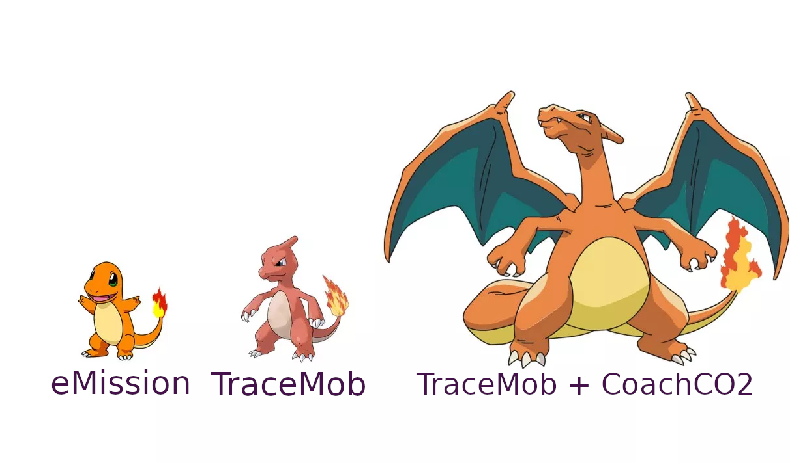
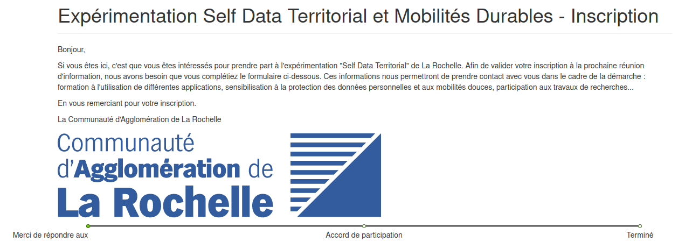

```{r, echo=FALSE}
library(metathis)
meta() %>% 
  meta_description(params$event) %>% 
  meta_name("github-repo" = paste0("datactivist/", params$slug)) %>% 
  meta_viewport() %>% 
  meta_social(
    title = params$title,
    url = paste0("https://datactivist.coop/", params$slug),
    image = params$image,
    image_alt = params$image_alt,
    og_type = "website",
    og_author = "Datactivist",
    og_locale = "fr_FR",
    og_site_name = "Datactivist",
    twitter_card_type = "summary",
    twitter_creator = "@datactivi_st")
```

layout: true

<style>
.remark-slide-number {
  position: inherit;
}

.remark-slide-number .progress-bar-container {
  position: absolute;
  bottom: 0;
  height: 4px;
  display: block;
  left: 0;
  right: 0;
}

.remark-slide-number .progress-bar {
  height: 100%;
  background-color: #e95459;
}
  
.quote {
  font-family: 'Rokkitt';
  font-weight: bold;
  font-style: italic;
  font-size: 28px;
}


</style>


`r paste0("<div class='my-footer'><span>", params$event, "</span> <center><div class=logo><a href='https://datactivist.coop/'></a></div></center></span></div>")` 


---

class: center, middle

Ces slides en ligne : `r paste0("http://datactivist.coop/", params$slug)`

Sources : `r paste0("https://github.com/datactivist/", params$slug)`


Les productions de Datactivist sont librement réutilisables selon les termes de la licence [Creative Commons 4.0 BY-SA](https://creativecommons.org/licenses/by-sa/4.0/legalcode.fr).

<BR>
<BR>


---

background-image: url("https://media.giphy.com/media/3osxYc2axjCJNsCXyE/giphy.gif")
class: center, top, inverse

## Le self data : nouveau paradigme

---

background-image: url("https://media.giphy.com/media/4FQMuOKR6zQRO/giphy.gif")
class: center, top, inverse

### Data ? De quoi on parle exactement

---


### Data ≠ données des réseaux sociaux


Deux assimilations se croisent souvent pour former un syllogisme :

1. data = données personnelles ;
2. données personnelles = données des réseaux sociaux ;
3. data = données des réseaux sociaux.

Or, chaque terme a d'autres définitions.

---

### Data = "ce qu'on attrape"

.quote["La tentation de l’idéalisme vient peut-être du mot même de données qui décrit aussi mal que possible ce sur quoi s’appliquent les capacités cognitives ordinaires des érudits, des savants et des intellectuels. Il faudrait remplacer ce terme par celui, beaucoup plus réaliste, d’.red[obtenues] et parler par conséquent de bases d’obtenues, de sublata plutôt que de data", **Bruno Latour**]

---

background-image: url("https://media.giphy.com/media/xT5LMxnyLqku0Ac6qY/giphy.gif")
class: center, top, inverse

### Data <- capteur + énergie


---

### Smartphone : arme de collecte massive

Exemple : [Tell all telephone (Die Zeit, 2009)](https://www.zeit.de/datenschutz/malte-spitz-data-retention).



---

background-image: url("https://media.giphy.com/media/G1ifnX4d5tYFACktp9/giphy.gif")
class: center, top, inverse

### Mais qui est propriétaire de ces données-là ?

---

### Le paradigme du "app to data"

La gouvernance actuelle des données produites par la majorité des apps mobiles peut se résumer par l'expression *"app to data"* :

au travers les CGU, les entreprises éditrices des applications de service mobile s'arrogent un droit de propriété sur les données captées sur leurs usager·ères via les devices.

---

background-image: url("https://media.giphy.com/media/iCS5WBHrudbqQMp6Fx/giphy.gif")
class: center, top, inverse

### Le self data : une alternative

---

### Le paradigme du "data to app"

Au lieu de placer l'app au centre de la gouvernance, le modèle .red[**self data**] propose de placer l'usager·ère sur lequel ou laquelle portent les données.

Pour reprendre la définition de la [Fing](https://fing.org/), initiatrice du concept :

> .quote["la production, l’exploitation et le partage de données personnelles par les individu·e·s, sous leur contrôle et à leurs propres fins"]

---

### Un tiers de confiance pour vos données


Source : [Kit Self Data Territorial](http://mesinfos.fing.org/implementer-le-self-data-sur-son-territoire-suivez-le-guide/), MesInfos / Fing

---

### Le self data territorial de La Rochelle

.center[

]

---

background-image: url("https://media.giphy.com/media/GbH8vRmrNHdVZhouBt/giphy.gif")
class: center, bottom, inverse

## Comment TraceMob vous rend vos données

---

background-image: url("https://media.giphy.com/media/co6DjYwuhG17ITs6VB/giphy.gif")
class: center, top, inverse

### Comment fonctionne un GPS ?

---

### "Global positionning system"

.pull-left[
**1. Un réseau**

* émetteur : 30 satellites à 20000 km d'altitude ;
* récepteur : des capteurs GPS.


**2. Un signal**
Des "pulse" contenant 3 données :

* nom du satellite ;
* heure de départ ;
* position.
]

.pull-right[
**3. Un calcul**

distance = (heure d'arrivé - heure de départ) * C

C : vitesse de la lumière

**4. Une triangulation**

La distance de trois pulse suffit à situer n'importe quel point en 3D.

**5. Trois coordonnées**
X ; Y ; Z.
]


---

### eMission

.pull-left[
TraceMob s'inspire d'une application développée par l'Université de Berkeley : [eMission](https://e-mission.eecs.berkeley.edu).

Intégralement open source (son code est dispo sur Github), cette application vise à constituer un *"journal de trajet personnel"* en permettant la récolte des trajets et des données associées :

* horaires ;
* durée ;
* trajectoires ;
* mode de transport.
]

.pull-right[

]

---

#### eMission en action 1/4

.center[

]

L'application se branche sur plusieurs composants du téléphone :
* GPS ;
* capteur de réseau (téléphonie et WiFi) ;
* accéléromètre.

Elle fonctionne **en arrière-plan**, c'est-à-dire sans avoir besoin d'être activée (comme Strava ou Waze). Elle reste en veille, prête à se déclencher dès que .red[l'accéléromètre] repère un mouvement du device.

---

#### eMission en action 2/4

Dès qu'un mouvement est capté par .red[l'accéléromètre], eMission débute la collecte des données issues du .red[GPS].

.center[

]

---

#### eMission en action 3/4

Quand .red[l'accéléromètre] note un arrêt prolongé du mouvement, TraceMob cesse la collecte de données du capteur .red[GPS].

.center[

]

---

#### eMission en action 4/4

La trace collectée va être analysée et confrontée à des algorithmes permettant de *"prédire"* le mode de déplacement utilisé en fonction de la physionomie de la trace :

* vitesse et arrêt ;
* point de passage (par exemple : si le véhicule s'arrête à des points identifiés comme arrêt de bus sur OpenStreetMap, la trace sera identifié comme un déplacement en bus).

.center[

]


---

### TraceMob : self data by design

.center[

]

---

### Vers CoachCO2 ...

.center[

]

---

background-image: url("https://media.giphy.com/media/umbIrcUJbmuIUZ1e7M/giphy.gif")
class: center, top, inverse

## Analyser sa mobilité

---

### Etape 0 : rejoignez l'expérience !



Il vous suffit de remplir [un simple formulaire](https://framaforms.org/experimentation-self-data-territorial-et-mobilites-durables-inscription-1613560399) pour :

1. recueillir votre accord de participation ;
2. recueillir votre consentement à l'utilisation de vos données ;
3. vous communiquer toutes les infos utiles.

---


background-image: url("https://media.giphy.com/media/kF0xdLiFxPCNvk5kFz/giphy.gif")
class: center, top, inverse

### La suite ... dès que vous serez inscrit·es !

.footnote[P.S. : l'inscription à l'expérimentation est obligatoire. Si vous l'avez râté, le formulaire est [là](https://framaforms.org/experimentation-self-data-territorial-et-mobilites-durables-inscription-1613560399)]

---
class: inverse, center, middle

# Merci ! Des questions ?

Contact : [Sylvain](mailto:sylvain@datactivist.coop) et [Romain](mailto:r.legall@numericite.eu)